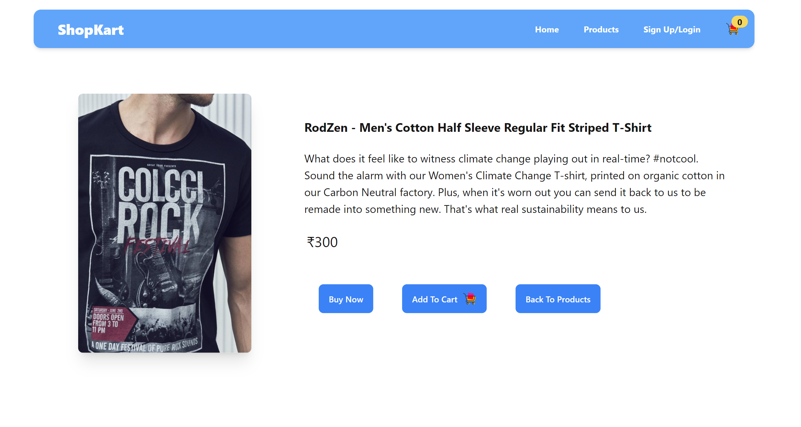
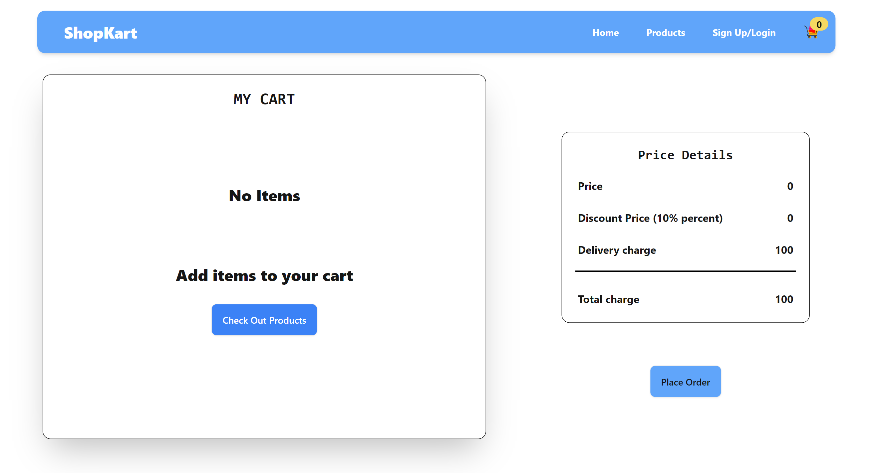

## ShopKart (Frontend Assignment TanX.fi)

## Overview
ShopKart is a Frontend web app build using ReactJS as an Assignment for Tanx.fi. 
### Deployed site without Internal JSON Server is https://tanxfifrontend.vercel.app/

### Total Tech Stack Used:
- ReactJS
- TailwindCSS
- DaisyUI (a tailwindCSS library for easy components styling)
- HTML
- Internal JSON server using npm runserver
- React Hooks and React Redux for state management

### Features Of  ShopKart:
- SignIn/Signup functionality
- Navigation from Home - Products - single Product - Cart - Placing an Order
- Showing Alerts respectively on different actions
- Visually apealing buttons with Hover Effects
- a fading Navbar which helps user to see information 
- RealTime updating of Cart items number which was done using React Redux
- single Page application switching from different components done using Usestate and conditional rendering

## Demo Images And Explaination
The images are related to various aspects of the frontend, including adding items to the cart, alerts, home page, orders, products, signing in, and signing up.

**Home Page/Landing Page when clicked on the site :**

  

**After Landing to the Home Page, User can click on Sign In/ Sign Up for redirecting to Sign In Page**

- If db.json file has a registered user then signin page shows alert that Mail Id has been already used else User can continue with creating their Account the following is in the below Image.

    

- If User enters Wrong Password / Wrong Credentials, alert will be provided stating about the Wrong Credentials depicted in the below Image.
  
  
    

**After Signing Up to the website, The Website Automatically Redirects Users to Home Page and their Cart Items will also get Updated,this functionality can be seen in a localhost server but cannot be observed in deployed server due to no server or backend deployed**

**The Demo Image of Products Page is below**

  

**Users can Directly add the product to the cart by clicking on the cart button on the specific Product,On click of specific product cart icon Users will be alerted telling them that Product has been added to Cart**

  

**If Users Want to Take a Closer Look on the Product They Can Click on the Card Image of a specfic Product which then will be redirected to the single Produt Page,Below is the demo Implementation Image**

  

**Users can directly Buy or Add to cart even on the Single Product Page,They also have an option to go back to the Products Page**

**When User Clicks on the Cart Page,they will redirected to the cart page where the all the items they have choosed will be displayed and now they can increase the quantity or remove the product from cart and they can also check the total price in real time even when they are changing the quantity**

**Below is the Image when User have Zero Products in their Cart**

  

  
**Now, Below is the Demo Image When Users Have Products in their Cart**

  

**After deciding the products and their Quantity Users can Place their Order by Clicking Place Order and on click of that users will get a modal showing success, Below is the Demo Image for said information**

  

**On click of Close,Users will be redirected to their Home Page with updating their cart Items to Zero and adding them into their Orders History.**

