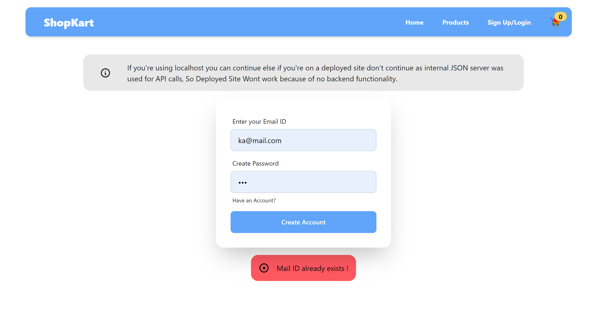

## ShopKart (Frontend Assignment TanX.fi)

## Overview
ShopKart is a Frontend web app build using ReactJS as an Assignment for Tanx.fi. 
### Deployed site without Internal JSON Server is https://tanxfifrontend.vercel.app/

### Total Tech Stack Used:
- ReactJS
- TailwindCSS
- DaisyUI (a tailwindCSS library for easy components styling)
- HTML
- Internal JSON server using npm runserver
- React Hooks and React Redux for state management

### Features Of  ShopKart:
- SignIn/Signup functionality
- Navigation from Home - Products - single Product - Cart - Placing an Order
- Showing Alerts respectively on different actions
- Visually apealing buttons with Hover Effects
- a fading Navbar which helps user to see information 
- RealTime updating of Cart items number which was done using React Redux
- single Page application switching from different components done using Usestate and conditional rendering

## Demo Images And Explaination
The images are related to various aspects of the frontend, including adding items to the cart, alerts, home page, orders, products, signing in, and signing up.

**Home Page/Landing Page when clicked on the site :**

  

**After Landing to the Home Page, User can click on Sign In/ Sign Up for redirecting to Sign In Page**

- If db.json file has a registered user then signin page shows alert that Mail Id has been already used else User can continue with creating their Account the following is in the below Image

    

- If User enters Wrong Password / Wrong Credentials, alert will be provided stating about the Wrong Credentials depicted in the below Image
  
    

- **Sign Up:**

  

  - **Product:**
  

- **Add to Cart Alert:**
  

- **Cart:**
  

- **Order:**
  

## Folder Structure

- **DemoImg/:**
  - `addtocartalert.png`: Image for add to cart alert.
  - `cart.png`: Image for the cart page.
  - `home.png`: Image for the home page.
  - `order.png`: Image for the order page.
  - `product.png`: Image for the product page.
  - `signin.png`: Image for the sign-in page.
  - `signup.png`: Image for the sign-up page.

